```mermaid
flowchart LR
    F[Checkout Request] --> G[Validate Cart] --> H[Check Prescription Requirements] --> I[DRAFT → CONFIRMED] --> J[Save Order]
```

```mermaid
flowchart LR
    F[Payment Webhook] --> G[Validate Signature] --> H[Update Payment Status] --> I[Transition Order → PAID]
```

# System Flow — Janta Pharmacy

## Purpose

This document explains **how requests flow through the system** at runtime.

For **why** the system is designed this way, see [architecture.md](./architecture.md).

---

## High-Level Request Flow

All domain requests follow the same path through the system layers.


---

## Step-by-Step Request Flow

<details>
<summary><strong>Click to expand detailed step-by-step breakdown</strong></summary>

### 1. Client Sends Request

A user action triggers an HTTP request to the backend API.

**Example requests across domain modules:**

```
# Authentication
POST /api/v1/auth/login
{ "phoneNumber": "+91...", "password": "..." }

# Catalog browsing
GET /api/v1/products?category=painkillers

# Cart operations
POST /api/v1/cart/items
{ "productId": "abc123", "quantity": 2 }

# Order lifecycle
POST /api/v1/orders/checkout

# Prescription upload
POST /api/v1/prescriptions
{ "imageUrl": "...", "notes": "..." }
```

---

### 2. Correlation ID Interceptor

The first layer to process the request.

**What it does:**
- Extracts or generates a unique `X-Correlation-ID`
- Attaches correlation ID to the request for downstream use
- Logs request start: `[INFO] [abc-123] --> POST /api/v1/orders/checkout`
- Logs completion: `[INFO] [abc-123] <-- POST /api/v1/orders/checkout 200 (45ms)`

**Why it matters:**
- Enables end-to-end request tracing
- Links logs across all layers for debugging

---

### 3. Validation Pipe

Validates and transforms incoming request data.

**What it does:**
- Validates DTO structure against decorators (`@IsString`, `@Min`, etc.)
- Strips unknown properties (`whitelist: true`)
- Rejects requests with unknown properties (`forbidNonWhitelisted: true`)
- Auto-transforms types (`enableImplicitConversion`)

**On validation failure:**
- Returns `400 Bad Request` with field-level error messages

---

### 4. JWT Auth Guard

Authenticates the request using JWT tokens.

**What it does:**
- Checks if route is marked `@Public()` — if so, skips auth
- Extracts Bearer token from `Authorization` header
- Verifies JWT signature and expiration
- Validates token type is `access` (not `refresh`)
- Attaches `AuthUser` to request for downstream access

**On authentication failure:**
- Returns `401 Unauthorized` with generic error

---

### 5. Controller

Thin HTTP layer that routes requests to services.

**What it does:**
- Receives validated and authenticated request
- Extracts user context via `@CurrentUser()` decorator
- Delegates to appropriate service method
- Returns standardized `ApiResponse` wrapper

**Design principle:**
- Controllers contain no business logic
- All domain decisions happen in services

---

### 6. Service Layer

Application logic coordinating domain operations.

**What it does:**
- Orchestrates domain entities and repositories
- Enforces business rules via domain methods
- Handles cross-cutting concerns (logging, audit)
- Throws domain exceptions for business rule violations

**Example flows by domain:**

| Domain | Service Flow |
|--------|-------------|
| Auth | `AuthService.login()` → validate credentials → generate tokens |
| Catalog | `ProductService.search()` → apply filters → return paginated results |
| Cart | `CartService.addItem()` → find draft order → add item → save |
| Order | `OrderService.confirm()` → validate state → transition → save |
| Prescription | `PrescriptionService.submit()` → validate image → create record |

---

### 7. Domain Layer

Core business logic and invariants.

**What it does:**
- Entities enforce their own invariants
- State machines validate transitions
- Value objects ensure data correctness

**Example invariants by domain:**

| Domain | Invariants |
|--------|-----------|
| Auth | Password meets complexity rules, tokens expire correctly |
| User | Phone number is unique, email format is valid |
| Catalog | Product prices are positive, stock cannot be negative |
| Order | State transitions follow lifecycle, one draft per user |
| Prescription | Image URL is valid, linked to user |

---

### 8. Repository Layer

Data access abstraction.

**What it does:**
- Implements `IRepository` interface per entity
- Currently uses in-memory `Map<string, Entity>`
- Future: PostgreSQL via Prisma (same interface)

**Why interfaces:**
- Services depend on abstractions, not implementations
- Enables swapping storage without changing business logic

---

### 9. Response Flow

Successful responses follow a consistent structure.


**Success response structure:**
```json
{
  "success": true,
  "data": { ... },
  "message": "Operation completed successfully",
  "correlationId": "abc-123"
}
```

</details>

---

## Error Flow

<details>
<summary><strong>Exception handling and error responses</strong></summary>

Errors are handled centrally by the `GlobalExceptionFilter`.


**Error response structure:**
```json
{
  "success": false,
  "error": {
    "code": "ORDER_NOT_FOUND",
    "message": "Order with ID xyz not found",
    "details": null
  },
  "correlationId": "abc-123",
  "timestamp": "2026-01-10T12:00:00.000Z"
}
```

**Error mapping:**

| Error Type | HTTP Status | Example |
|------------|-------------|---------|
| ValidationError | 400 | Invalid DTO fields |
| UnauthorizedException | 401 | Missing/expired token |
| ForbiddenException | 403 | User doesn't own resource |
| NotFoundException | 404 | Entity not found |
| BusinessException | 409 | Invalid state transition |
| Unknown | 500 | Unexpected server error |

</details>

---

## Module Interaction Flow

Domain modules interact through well-defined service interfaces.


**Key principles:**
- Modules communicate via service interfaces
- No direct repository access across modules
- Each module owns its data
- Cross-module calls are explicit and logged

---

## Domain Module Flows

Each domain module follows the common request flow but has unique business logic. This section describes the flow through each module at a conceptual level.

---

<details>
<summary><strong>🔐 Authentication Module</strong> — Identity, credentials, session management</summary>


**Request types:**
| Action | Endpoint | Auth Required |
|--------|----------|---------------|
| Register | `POST /auth/register` | No (public) |
| Login | `POST /auth/login` | No (public) |
| Refresh | `POST /auth/refresh` | No (uses refresh token) |
| Logout | `POST /auth/logout` | Yes |

**Flow details:**
- Registration validates phone/email uniqueness, hashes password, creates user
- Login validates credentials against stored hash, returns JWT pair
- Refresh token validates and issues new access token
- User context (`AuthUser`) is extracted from JWT and attached to all subsequent requests

**Persistence:**
- Credentials stored separately from user profile
- Refresh tokens tracked for revocation

</details>

---

<details>
<summary><strong>👤 User Module</strong> — Profiles, preferences</summary>


**Request types:**
| Action | Endpoint | Auth Required |
|--------|----------|---------------|
| Get profile | `GET /users/me` | Yes |
| Update profile | `PATCH /users/me` | Yes |
| Get addresses | `GET /users/me/addresses` | Yes |

**Flow details:**
- User ID always extracted from JWT, never from client input
- Profile updates validate ownership before applying
- Addresses managed as part of user profile

**Persistence:**
- User data in user repository
- One-to-many relationship with addresses

</details>

---

<details>
<summary><strong>📦 Catalog Module</strong> — Products, categories, search</summary>


**Request types:**
| Action | Endpoint | Auth Required |
|--------|----------|---------------|
| List products | `GET /products` | No (public) |
| Search products | `GET /products?q=...` | No (public) |
| Get product | `GET /products/:id` | No (public) |
| List categories | `GET /categories` | No (public) |

**Flow details:**
- Product listings are public (no auth required)
- Search applies text matching, category filters, pagination
- Product details include pricing, availability, prescription requirements
- Catalog data is read-heavy; future caching layer anticipated

**Persistence:**
- Products and categories in catalog repository
- Inventory status referenced (not owned) by catalog

</details>

---

<details>
<summary><strong>🛒 Order Module</strong> — Cart, checkout, order lifecycle</summary>





**Request types:**
| Action | Endpoint | Auth Required |
|--------|----------|---------------|
| Get cart | `GET /cart` | Yes |
| Add to cart | `POST /cart/items` | Yes |
| Update quantity | `PATCH /cart/items/:productId` | Yes |
| Remove item | `DELETE /cart/items/:productId` | Yes |
| Checkout | `POST /orders/checkout` | Yes |
| Get orders | `GET /orders` | Yes |
| Cancel order | `POST /orders/:id/cancel` | Yes |

**Flow details:**
- Cart is a Draft Order (not a separate entity)
- One draft order per user enforced
- Checkout validates items and transitions state
- Order lifecycle follows state machine (DRAFT → CREATED → CONFIRMED → PAID → SHIPPED → DELIVERED)
- Cancellation allowed from non-terminal states

**Cross-module interactions:**
- Reads product details from Catalog module
- Checks prescription requirements before checkout
- Triggers payment flow on checkout (future)

**Persistence:**
- Orders stored in order repository
- Order items embedded within order

</details>

---

<details>
<summary><strong>📋 Prescription Module</strong> — Upload, verification</summary>


**Request types:**
| Action | Endpoint | Auth Required |
|--------|----------|---------------|
| Upload prescription | `POST /prescriptions` | Yes |
| Get my prescriptions | `GET /prescriptions` | Yes |
| Get prescription | `GET /prescriptions/:id` | Yes |
| Review (admin) | `POST /prescriptions/:id/review` | Yes (pharmacist role) |

**Flow details:**
- Users upload prescription images for verification
- Prescriptions start in PENDING status
- Pharmacist reviews and approves/rejects
- Approved prescriptions can be linked to orders containing prescription-required items

**Cross-module interactions:**
- Linked to orders for prescription-required products
- User ownership validated from auth context

**Persistence:**
- Prescription records in prescription repository
- Image URLs stored (actual images in object storage - future)

</details>

---

<details>
<summary><strong>💳 Payment Module</strong> — Processing, confirmation</summary>




**Request types:**
| Action | Endpoint | Auth Required |
|--------|----------|---------------|
| Initiate payment | `POST /orders/:id/pay` | Yes |
| Payment webhook | `POST /payments/webhook` | No (signature validated) |

**Flow details:**
- Payment initiated after order confirmation
- Integration with external payment gateway (future)
- Webhook receives payment confirmation from gateway
- Successful payment transitions order to PAID state

**Cross-module interactions:**
- Reads order details from Order module
- Updates order state on payment success
- Triggers notification on payment events (future)

**Persistence:**
- Payment records linked to orders
- Transaction IDs stored for reconciliation

</details>

---

<details>
<summary><strong>📊 Inventory Interaction</strong> — Stock validation, reservation</summary>


```mermaid
flowchart LR
    H[Order Cancelled] --> I[Release Stock]
```

```mermaid
flowchart LR
    J[Order Shipped] --> K[Deduct Stock]
```

**Flow details:**
- Stock checked when adding items to cart
- Stock reserved when order is confirmed
- Stock released if order is cancelled
- Stock deducted when order ships

**Cross-module interactions:**
- Catalog module reads stock for availability display
- Order module validates and updates stock during lifecycle
- Admin operations manage stock levels (future)

**Persistence:**
- Stock levels stored per product
- Stock movements logged for audit

</details>

---

## Cross-Cutting Concerns

<details>
<summary><strong>Authentication, Logging, Error Handling, Request Tracing</strong></summary>

### Authentication

- JWT-based with access and refresh tokens
- Access token validated on every protected request
- User context extracted from token, not client input
- Role-based authorization via `@Roles()` decorator

### Logging

- Structured logs with correlation ID
- Request lifecycle: start → processing → completion
- Error details logged server-side only (not exposed to client)

### Error Handling

- Centralized via global exception filter
- Domain exceptions map to appropriate HTTP codes
- Stack traces logged internally, never returned to client
- Generic messages for unexpected errors

### Request Tracing

- Correlation ID flows through all layers
- Client can provide ID or server generates UUID
- Included in all responses for support debugging

</details>

---

## Summary

| Layer | Responsibility | Key Component |
|-------|---------------|---------------|
| Entry | HTTP handling, CORS | NestJS + main.ts |
| Interceptor | Correlation ID, logging | CorrelationIdInterceptor |
| Validation | DTO validation | ValidationPipe |
| Auth | JWT verification | JwtAuthGuard |
| Controller | Route handling | *Controller classes |
| Service | Business orchestration | *Service classes |
| Domain | Business rules | Entities, Value Objects |
| Repository | Data access | IRepository implementations |
| Error | Exception handling | GlobalExceptionFilter |

| Domain Module | Responsibility |
|--------------|----------------|
| Auth | Identity, credentials, tokens |
| User | Profiles, addresses, preferences |
| Catalog | Products, categories, search |
| Order | Cart, checkout, order lifecycle |
| Prescription | Upload, verification, linking |
| Payment | Payment processing, webhooks |
| Inventory | Stock validation, reservation |

This flow ensures consistent request handling, proper error responses, and full traceability across all domain modules.
